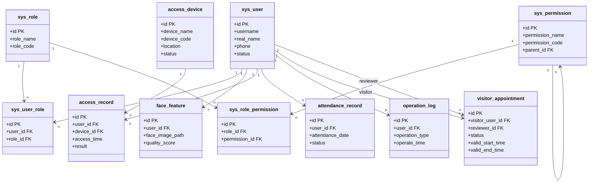
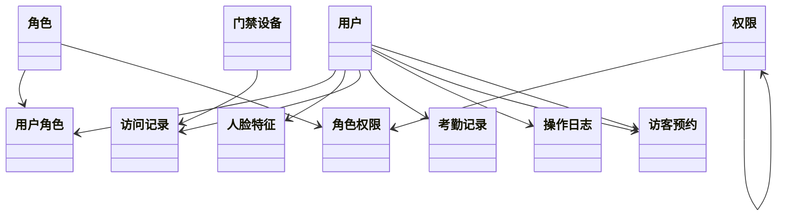

# 人脸识别门禁系统数据库 UML 图（紧凑版）

说明：
- 该版本用于论文排版，尽量控制横向长度，使长宽比更均衡。
- 仅保留主键、外键和少量核心业务字段。
- 关系依据 `face_access_system.sql` 中字段语义整理。

```mermaid
classDiagram
direction TB

class sys_user {
  +id PK
  +username
  +real_name
  +phone
  +status
}

class sys_role {
  +id PK
  +role_name
  +role_code
}

class sys_permission {
  +id PK
  +permission_name
  +permission_code
  +parent_id FK
}

class sys_user_role {
  +id PK
  +user_id FK
  +role_id FK
}

class sys_role_permission {
  +id PK
  +role_id FK
  +permission_id FK
}

class face_feature {
  +id PK
  +user_id FK
  +face_image_path
  +quality_score
}

class access_device {
  +id PK
  +device_name
  +device_code
  +location
  +status
}

class access_record {
  +id PK
  +user_id FK
  +device_id FK
  +access_time
  +result
}

class attendance_record {
  +id PK
  +user_id FK
  +attendance_date
  +status
}

class visitor_appointment {
  +id PK
  +visitor_user_id FK
  +reviewer_id FK
  +status
  +valid_start_time
  +valid_end_time
}

class operation_log {
  +id PK
  +user_id FK
  +operation_type
  +operate_time
}

sys_user "1" --> "n" sys_user_role
sys_role "1" --> "n" sys_user_role

sys_role "1" --> "n" sys_role_permission
sys_permission "1" --> "n" sys_role_permission
sys_permission "1" --> "n" sys_permission

sys_user "1" --> "n" face_feature
sys_user "1" --> "n" access_record
access_device "1" --> "n" access_record

sys_user "1" --> "n" attendance_record
sys_user "1" --> "n" operation_log

sys_user "1" --> "n" visitor_appointment : visitor
sys_user "1" --> "n" visitor_appointment : reviewer
```

## 可直接放论文的更简版

```mermaid
classDiagram
direction TB

class 用户
class 角色
class 权限
class 用户角色
class 角色权限
class 人脸特征
class 门禁设备
class 访问记录
class 考勤记录
class 访客预约
class 操作日志

用户 --> 用户角色
角色 --> 用户角色
角色 --> 角色权限
权限 --> 角色权限
权限 --> 权限
用户 --> 人脸特征
用户 --> 访问记录
门禁设备 --> 访问记录
用户 --> 考勤记录
用户 --> 操作日志
用户 --> 访客预约
用户 --> 访客预约
```

